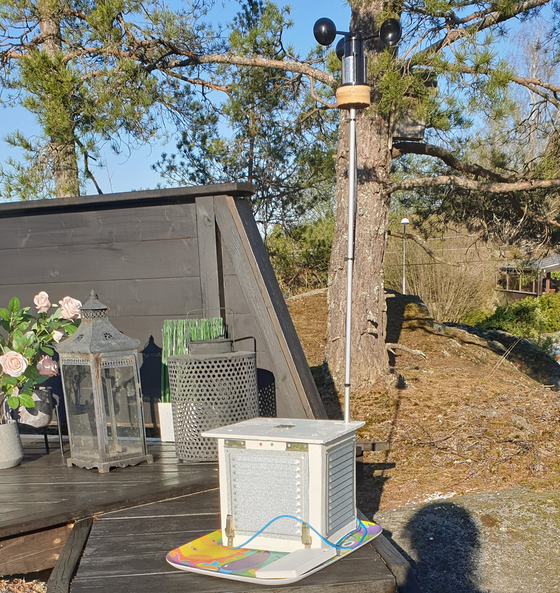
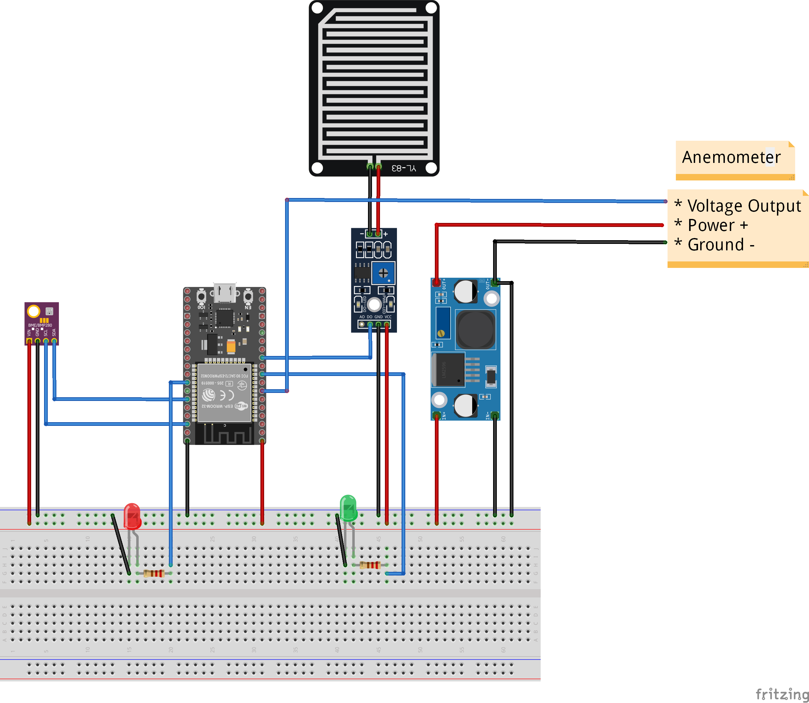

# Weather Station



## Requirements

- VS Code
- C++
- PlatformIO 
- C++ libraries (Adafruit CCS811 Library, ArduinoJson, SparkFun BME280, SparkFun CCS811 Arduino Library)

## Instructions

### Configuration

Create `src/config.h` with the following format
````
// WIFI configuration
#define WIFI_SSID "the wifi ssid"
#define WIFI_PASSWORD "the wifi password"

// API configuration
#define API_USERNAME "weatherstation"
#define API_URL "https://theactualapi.org"
#define API_PASSWORD "donotuseinproduction"
````

### Operating physical weather station

1. Plug in USB to a 5 volt power source
2. Check for the green LED light to flash 3 times followed by one long. (If the red LED ever start to shine an error has occurred)


## Troubleshooting

- 3 green flashes = setup completed
- Green + Red shine = Trying to connect to wifi
- 1 long green flash = http post request successful

If the red LED starts to shine after giving the weather station power then 3 possible errors has occurred.
1. Can't connect to wireless network.
2. Error in [BME280](https://www.bosch-sensortec.com/products/environmental-sensors/humidity-sensors-bme280/) sensor.
3. Error in [CCS811](https://cdn.sparkfun.com/assets/learn_tutorials/1/4/3/CCS811_Datasheet-DS000459.pdf) sensor.

If the red LED starts to shine after the 3 green flashes then the weather station has issues connecting to [REST API](https://github.com/tullinge/weather-station-api).

## Data format
````
{
    "CO2": "0",
    "humidity": "34.5078125000",
    "rain": "false",
    "TVOC": "0",
    "temperature": "28.0100002289",
    "wind": "0.0000000000",
    "pressure": "99050"
}
````

## Contributors
- Oskar Löf (JoeMamasXD) <oskar.lof@skola.botkyrka.se>
- Max Lundberg (Fajterman) <max.lundberg@skola.botkyrka.se>
- Einar Persson <einar.persson@botkyrka.se>
